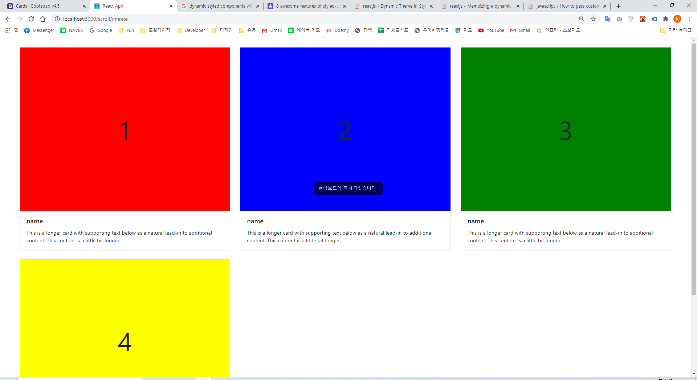
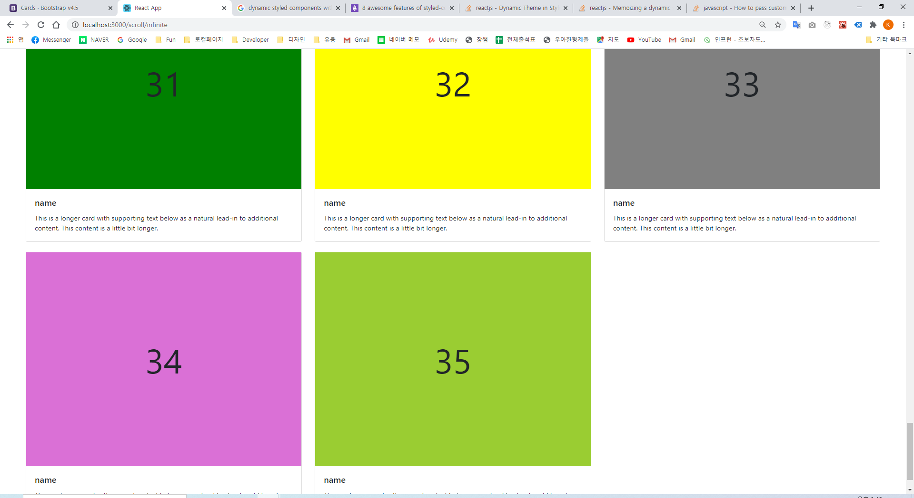

## # Scroll Infinite 무한 스크롤

-   데이터를 가지고 올때는 startIdx 와 endIdx 인덱스를 이용하여 4개씩 가지고 오고
-   스크롤이 90%이상 내려갈 경우 startIdx 와 endIdx 인덱스를 4개씩 업데이트 해주고 데이터를 가져옴
-   데이터는 기존 데이터에 추가해준다.
-   [소스보기](../ReactComponents/src/components/scroll/ScrollInfinite.js)

    |  |
    | ------------------------------- |
    |  |
