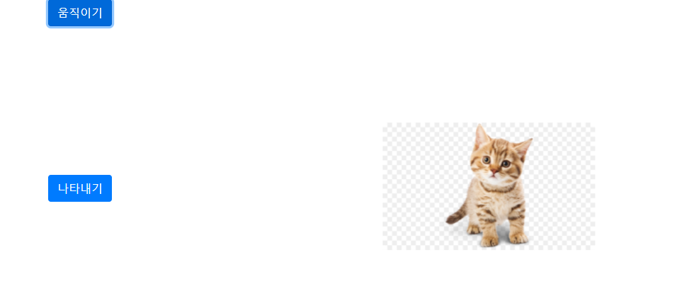
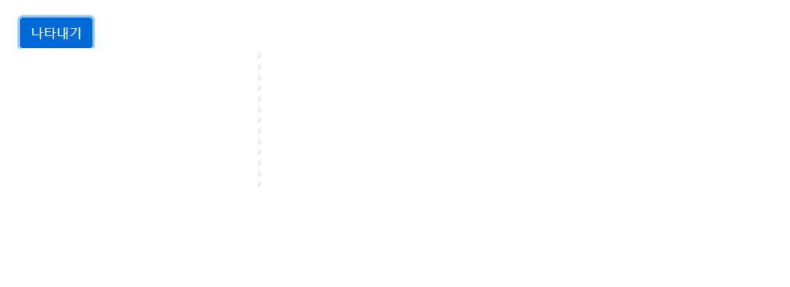
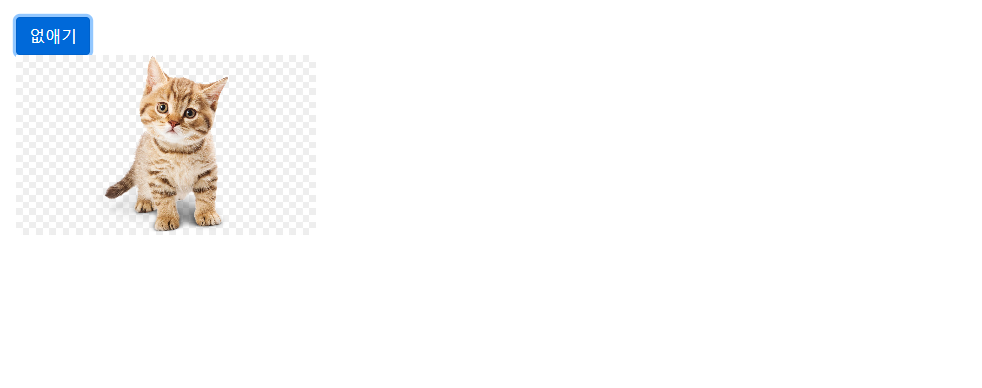

## # 애니메이션

### 1. 이동하기

-   [소스보기](../ReactComponents/src/components/Animation/Translate.js)
     |
    ---|
     |

### 2. 나타나기

-   [소스보기](../ReactComponents/src/components/Animation/PlayState.js)

    |  |
    | ------------------------------- |
    |  |
