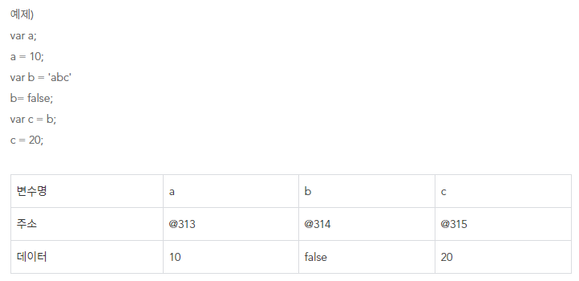
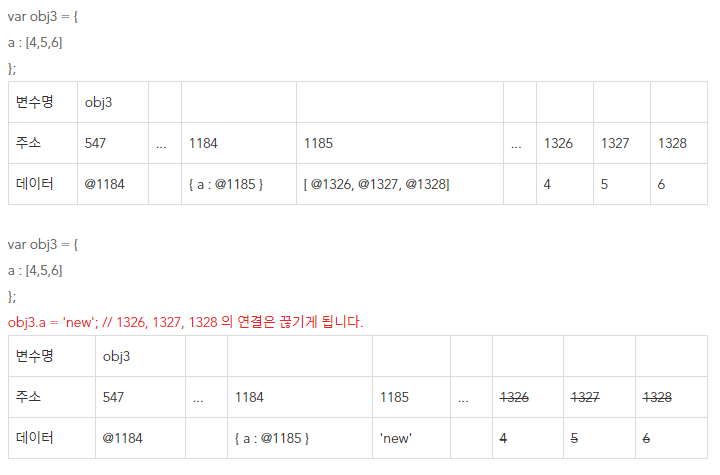

## ※ 자바스크립트의 기본형 변수와 참조형 변수란 무엇인가?

-   ### 1-1 자바스크립트 기본형 변수(Primitive Type)

    -   Number, String, Boolean, null, undefined, symbol
    -   값을 그대로 할당한다.
    -   비어있는 데이터 공간 확보 -> 변수명과 매칭 -> 매칭 주소에 데이터 저장

    |  |
    | -------------------------------- |

-   ### 1-2 자바스크립트 참조형 변수

    -   Object, Array, Function, RegExp(정규 표현식), ES6(map, set)
    -   값이 저장된 주소를 할당
    -   비어있는 데이터 공간 확보 -> 객체 속 프로퍼티 공간 확보 -> 객체의 프로퍼티 명과 주소를 매칭 -> 확보 했던 두번재 주소에 데이터 할당

    |  |
    | -------------------------------- |

-   ### 1-3 출처
    -   https://limboy.tistory.com/382
