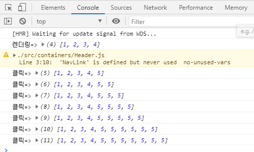

## ※ JSX

-   ### 정의
    -   html 처럼 생겼지만 아님
    -   바벨이라는 도구로 자바스크립트로 변환된다.
-   규칙

    1.  컴포넌트에 여러가지 요소가 있다면 반드시 하나의 부모 태그로 감싸줘야한다.
    1.  Virtual DOM에서 변화를 감지할 때 효율적으로 비교하도록 컴포넌트 내부는 하나의 DOM 트리 구조여야한다.
    1.  자바스크립트를 표현하려면 JSX 내부에서 {}안에 작성하면 된다.
    1.  if문은 사용불가 => 조건부연산자 (삼항연산자) 써야한다.
    1.  컴포넌트는 undefinded를 render하면 안된다. => 아무것도 렌더링 되지 않았다고 오류나옴
    1.  태그는 꼭 닫아줘야한다.
    1.  class 대신 className
    1.  DOM에서 스타일 지정시 객체형태로 넣어줘야한다. 또한 - 는 없애고 카멜표기법(대문자)로 작성해야한다.

    ```JSX
        const style = {
            ackgroundColor: 'black',
            color: 'aqua',
            fontSize: '48px', // font-size -> fontSize
            fontWeight: 'bold', // font-weight -> fontWeight
            padding: 16 // 단위를 생략하면 px로 지정됩니다.
        };

    ```

    9. {/_ 주석은 이렇게 작성합니다. _/}

---

## ※ 불변성 유지 Immutability

-   ### 얕은 복사

    -   리덕스는 내부적으로 데이터가 변경되는 것을 감지하기 위해 얕은 비교를 검사를 한다.
    -   즉 얕은 복사로 비교하여 데이터가 변경된 경우에만 변화를 감지하고 rerendering 해준다.
    -   얕은 복살르 사용하는 이유는 객체의 변화를 감지할때 객체의 깊숙한 안쪽까지 비교하는 것이 아니라 겉핥기 식으로 비교하여 좋은 성능을 유지 할 수 있기 때문이다.

-   ### 불변성 유지해야 하는 이유

    -   리덕스는 얕은 복사로 값을 비교하기 때문에 기존 값의 불변성을 지켜주고 새로운 값으로 변경 해주어야 변화를 감지하여 rerendering 해준다
    -   리액트에서 상태를 업데이트할 때는 기존 상태를 그대로 두면서 새로운  값을 넣어줘야한다.
    -   불변성이 지켜지지 않으면 객체 내부의 값이 새로워져도 바뀐 것을 감지하지 못한다.

    -   **불변성 유지하지 않았을 경우**

        ```JSX

        const items = [1, 2, 3, 4, 5];
        const changedItems = items; // 복사가 아니라 같은 배열을 가르키고 있는 레퍼런스가 하나 더 만들어 진 것임
        changedItems.push(6);

        console.log(items);        // [ 1, 2, 3, 4, 5, 6 ]
        console.log(changedItems); // [ 1, 2, 3, 4, 5, 6 ]
        // items의 불변성을 지켜주지 않았음
        // 변화를 감지하지 못함

        ```

    -   **불변성 유지할 경우**

        ```JSX
        //
        const items = [1, 2, 3, 4, 5];
        const changedItems = [...items, 6];

        console.log(items);        // [ 1, 2, 3, 4, 5 ]
        console.log(changedItems); // [ 1, 2, 3, 4, 5, 6 ]
        // items의 불변성이 유지되어 얕은 복사로도 변화 감지 가능

        ```

-   ### 예제

    ```JSX
    const Test = () => {
        const [items, setItems] = useState([1, 2, 3, 4]);

        const handleClick = () => {
            const newItems = items;
            newItems.push(5);
            console.log('클릭', newItems);
            setItems(newItems);
        };

        console.log('렌더링', items);
        return (
            <div>
                {items.map((item) => (
                    <div>{item}</div>
                ))}
                <button onClick={handleClick}>Item추가</button>
            </div>
        );
    };

    export default Test;
    ```

    -   item 추가 버튼을 클릭할 경우 newItems가 변하지만 실제 페이지는 리렌더링 되지 않는다.

    -   불변성을 유지하지 않는 경우 state를 변화시켜도 변화한 값과 기존 값이 일치하다고 판단하여 리렌더링 하지 않는다

    |  |  |
    | --------------------------- | --------------------------- |


## 웹 성능 최적화

### 로딩 성능 최적화

-   이미지 사이즈 최적화
-   code split
-   텍스트 압축

### 렌더링 성능 최적화

-   Bottleneck 코드 최적화

### Lighthouse 사용

-   #### Opportunities - 리소스의 관점에서 가이드 제시 (로딩 성능 최적화)
    -   Properly size images
        -   실제 렌더링 되는 사이즈 보다 2배로 최적화 하는 것이좋다
        -   120 x 120 pixels 이라면 240 x 240 pixels로 사용
        -   API를 통해서 이미지 받아오는 경우 이미지 cdn을 사용하는 것이 좋다.
        -   Image CDN 사용
            -   CDN: Contents Delivery Network
            -   CDN: 물리적 거리의 한계를 극복하기 위해 사용자와 가까운 곳에 컨텐츠 서버를 두는 기술
            -   Image CDN: 원본 형태의 이미지를 가공해서 사용자에게 전달해준다.
            -   Image CDN: 사이즈를 변경하거나 포멧을 변경할 수 있다.
            -   Image CDN: http://cnd.image.com?src=[img src]&width=200&height=100
        -   예시)
            -   브런치에서 실제 로딩되는 이미지 주소를 보면
            -   //img1.daumcdn.net/thumb/C320x520.fjpg/?fname=https://t1.daumcdn.net/section/oc/5ee6d6bff0214a3086fa8825708a43b1
            -   daumcdn을 이용하여 image를 넘겨주고 있다.
        -   사용
            -   cdn 직접 구현 어려울 경우
            -   Image CDN 솔루션 => img Ix
            -   https://www.imgix.com/
    -   Remove unused Javascript
    -   Remove duplicate modules in Javascript bundles
    -   Aviod serving legach Javascript to modern browsers
-   #### Diagnostics - 페이지 실행 관점에서 가이드 제시 (렌더링 성능 최적화)
    -   Reduce JavaScript execution time
        -   Lighthouse로는 알 수 없음
        -   Performance
            -   record 할 필요 없이 옆에 리프레시 버튼 누르면 됌
            -   Article 컴포넌트 밑에 removeSpecialCharactor 함수가 여러번 끊어져서 실행되고 있음
            -   너무 많은 리소스를 차지하다 보니 가비지 컬렉터가 중간중간 끊었음
            -   Minor GC를 보면 가비지 컬렉터
