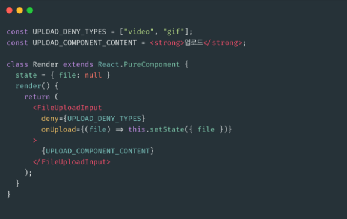
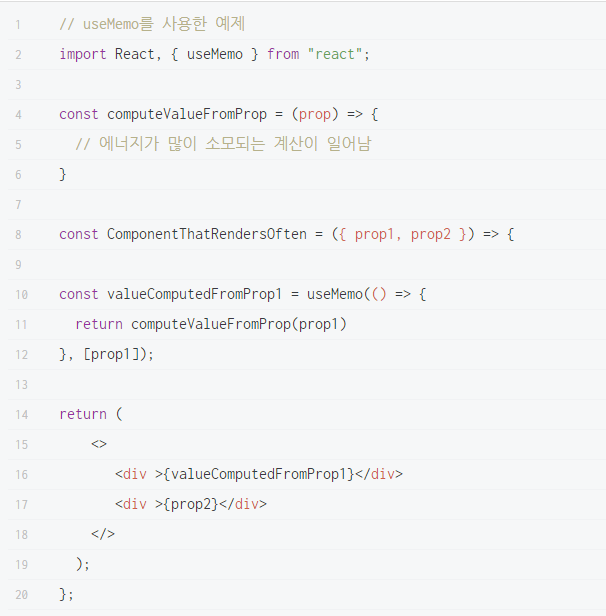
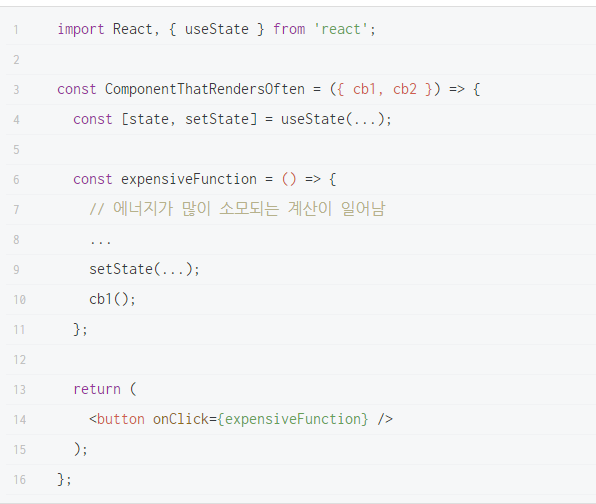

## ※ 리액트 리렌더링 최적화 방법

### 1-1 변하지 않는 상수 데이터

-   렌더링 단계에서 생성하는 것이 아니라 정적으로 생성해준다.
-   데이터로 분리할 수 있는 값은 따로 상수처럼 사용해준다.



### 1-2 React.Memo()

-   부모에게 리렌더링이 일어나도 자식은 리렌더링이 일어나지 않도록 해준다.
-   자식: export Child({ prop1, prop2 }) => { return <div>Child </div> }
-   부모 컴포넌트에서 오는 prop1과 prop2가 변경되지 않았다면 자식은 리랜더링 x
-   이때, prop1이 이벤트 핸들 함수라면, useCallback으로 처리해줘야한다.

### 1-3 useMemo

-   렌더링 될때마다 외부함수를 이용한 계산을 방지해준다.
-   Dependecy가 변경되었을 때만 값을 다시 계산하도록 기억한다.
-   사용. 특정 props나 특정 state가 변경 될때만 다시 계산하는 경우
-   사용. 함수값 계산 프로세스가 에너지 소모가 많은 경우
-   사용x. 클래스 컴포넌트에서는 사용하지 않는다. (render부분만 리랜더링 됌)
-   사용x. 해당 함수를 scope 밖으로 옮길 수 있는 경우
-   예시. const result = useMemo(func(value), [value])
-   예시. 컴포넌트가 렌더링 되더라도 value값이 바뀌지 않았다면
-   예시. result 값은 외부 함수로 새로 구해지지 않고 기존 값을 재사용

| useMemo() 사용 x                                                 | useMemo() 사용 o                                          |
| ---------------------------------------------------------------- | --------------------------------------------------------- |
|                                     |                              |
| 렌더링 될 때마다 valueComputedFromProp 함수가 매번 계산되고 있음 | 렌더링이 되더라도 props1 값이 바뀐 경우에만 함수가 계산됌 |

### 1-4 useCallback

-   함수형 컴포넌트에서 렌더링 될때마다 함수가 매번 생성되는 것을 방지해준다.
-   [deps] 안에 참조값들이 변했을 때만 함수를 재생성 하고 아니면 그대로 사용
-   자식한테 props 값으로 넘겨주는 이벤트 핸들 함수들은 useCallback처리 해야 좋다.

| useCallback() 사용 x                            | useCallback() 사용 o                                      |
| ----------------------------------------------- | --------------------------------------------------------- |
|                    |                              |
| 렌더링 될때마다 expressiveFunction이 재생성된다 | Cb1값이 변경된 경우에만 expressiveFunction이 재생성 된다. |

### 1-4 useSelector 사용시

-   State를 조회할 때 객체를 생성하면 하나의 값만 수정해도 다른 값도 재선언된다.
-   아래 예제에서는 count값만 수정해도 prevCount 와 관련된 것도 전부 랜더링됌

```jsx
const { count, prevCount } = useSelector(
    (stat: (RootState) => {
        count: state.countReducer.count,
        prevCount: state.countReducer.prevCount,
    })
);
```

1. 독립선언

```JSX
const count = useSelector(state:RootState => state.countReducer.count)
const prevCount = useSelector(state:RootState => state.countReducer.prevCount)
```

2. equalityFn

```JSX
const { count, prevCount } = useSelector(stat: RootState => ({
    count: state.countReducer.count,
    prevCount: state.countReducer.prevCount,
}), (prev, next) => {
    return prev.count === next.count && prev.prevCount === next.prevCount
});
```

3. shallowEqual

```JSX
const { count, prevCount } = useSelector(stat: RootState => ({
    count: state.countReducer.count,
    prevCount: state.countReducer.prevCount,
}), shallowEquel)

```

### 1-5 React.PureComponent 또는 sholudComponentUpdate

-   클래스형 컴포넌트 에서는 souldComponentUpdate를 통해 값이 변했을 경우에만 업데이트를 할 수 있다. PureComponent는 shouldComponentUpdate기능이 내장되어 있음

### 출처

-   https://im-developer.tistory.com/198
-   https://medium.com/vingle-tech-blog/react-%EB%A0%8C%EB%8D%94%EB%A7%81-%EC%9D%B4%ED%95%B4%ED%95%98%EA%B8%B0-f255d6569849
-   https://blog.woolta.com/categories/1/posts/200
-   https://blog.bitsrc.io/10-ways-to-optimize-your-react-apps-performance-e5e437c9abce
