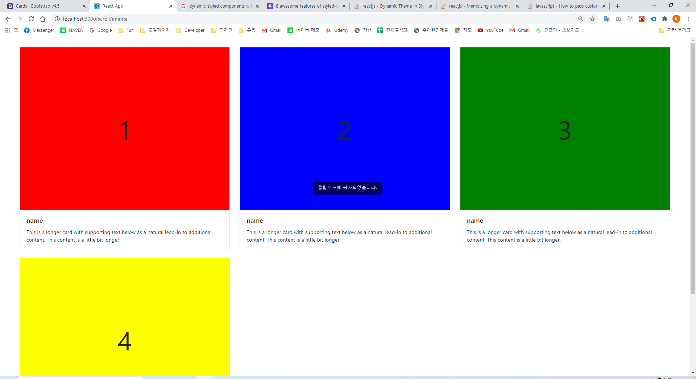
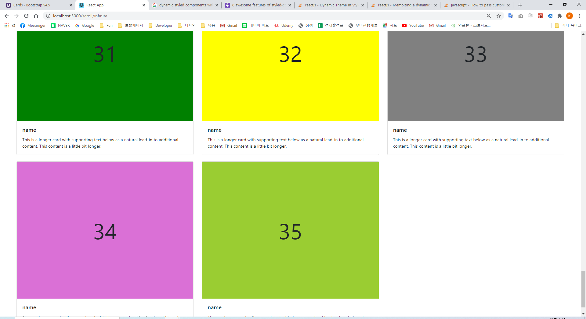

## ※ ScrollBasic

-   거리 백분율 구하기
-   scrollTop / (scrollHeight - clientHeight) \* 100
-   https://medium.com/@ghur2002/react%EC%97%90%EC%84%9C-infinite-scroll-%EA%B5%AC%ED%98%84%ED%95%98%EA%B8%B0-128d64ea24b5

    |  |
    | ------------------------------- |
    |  |

## ※ Scroll Infinite 무한 스크롤

-   데이터를 가지고 올때는 startIdx 와 endIdx 인덱스를 이용하여 4개씩 가지고 오고
-   스크롤이 90%이상 내려갈 경우 startIdx 와 endIdx 인덱스를 4개씩 업데이트 해주고 데이터를 가져옴
-   데이터는 기존 데이터에 추가해준다.

    |  |
    | ---------------------------------- |
    |  |
