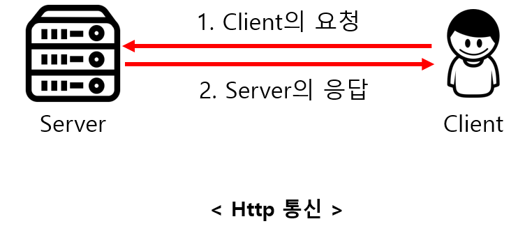
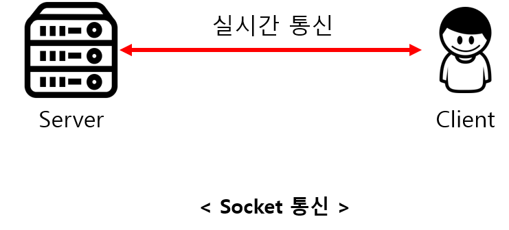

## HTTP 통신 vs Socket 통신

-   #### 1-1 http 통신

    -   Client가 요청을 보내는 경우에만 Server가 응답하는 단방향 통신
    -   Server로부터 응답을 받는 후에는 연결이 바로 종료된다.
    -   실시간 연결이 아니고, 필요한 경우에만 Server로 요청보내는 상황에 유용하다.
    -   요청을 보내 Server의 응답을 기다리는 어플리케이션의 개발에 주로 이용된다.

-   #### 1-2 Socket 통신
    -   Server와 Client가 특정 Port를 통해 실시간으로 양방향 통신을 하는 방식
    -   Server와 Client가 계속 연결을 유지하는 양방향 통신이다.
    -   실시간으로 데이터를 주고받는 상황이 필요한 경우에 사용된다.
    -   실시간 동영상 Streaming이나 온라인 게임
    -   Server 역시 Client로 요청을 보낼 수 있다.

| 분류   | 이미지                          |
| ------ | ------------------------------- |
| http   |  |
| Socket |  |

-   #### 출처
    https://mangkyu.tistory.com/48
