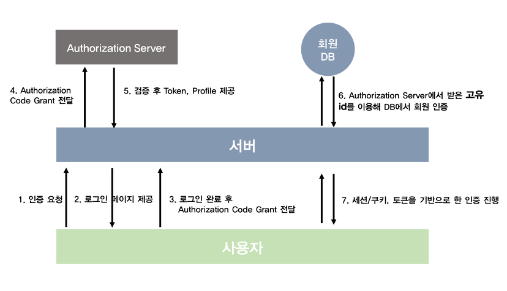
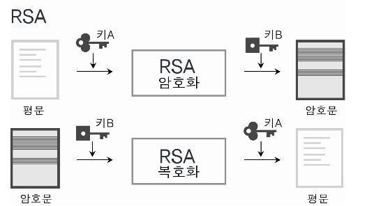

## ※ 엑세스토큰 인증 & RSA 키페어 인증

-   ### 1 엑세스토큰 인증방식

    -   #### 정의

        1. 사용자가 서버에게 로그인을 요청한다
        2. 서버는 사용자에게 특정 쿼리들을 붙인 (SNS) 로그인 URL을 사용자에게 보낸다.
        3. 사용자는 해당 URL로 접근하여 로그인을 진행한후 권한증서(code)를 담아 서버에 보낸다
        4. 서버는 해당 권한 증서를 (SNS) Authorization Server로 요청한다.
        5. 서버는 권한 증서 확인후, Access Token 을 돌려준다.
        6. 받은 Access Token을 이용하여 DB에 유저 정보가 있다면 로그인, 없으면 회원가입을 진행
        7. Access Token을 이용하여 한정된 서비스 사용

        |  |
        | ------------------------- |

    -   #### 2 장점

        -   서버에서 사용자 로그인 정보를 기억하기 위해 사용하는 리소스가 적음
        -   사용자 쪽에서 로그인 상태를 지닌 토큰을 가지고 있으므로 서버의 확장성이 매우 높다.
        -   서버의 인스턴스가 늘어나도 서버끼리 사용자의 로그인 상태를 공유하고 있을 필요가 없음.
        -   클라이언트가 서버에 요청을 보낼 때 쿠키를 보낼 필요가 없으므로 보안성도 좋다.
        -   토큰을 사용하면 다른 서비스 권한을 공유할 수 있다(Facebook, LinkedIn, GitHub, Google 계정)

    -   #### 3 엑세스 토큰이란

        -   엑세스 토큰은 성공적으로 로그인 했음을 증명하는 암호문 형태의 증서이다.
        -   해당 문자열 안에는 사용자의 로그인 정보와 서버에서 발급되었음을 증명하는 서명이 있음
        -   만료기간이 있어서 영구적이진 않다.

    -   #### 4 출처
        -   https://tansfil.tistory.com/60
        -   https://dreamaz.tistory.com/22

-   ### RSA 키페어 인증방식

    -   #### 정의

        -   모든 공개키 암호와 알고리즘은 일방향 함수를 사용한다.
        -   일방향 함수는 한쪽으로 계산이 용이한 반면 그 반대쪽으로는 계산하기 매우 어려운 함수이다.
        -   공개키는 모두에게 알려져있으며 일방향 함수를 이용하여 메시지를 암호화하는데 쓰인다
        -   공개키와 개인키가 같이 있어야 암호화를 복호화 할 수 있다.
        -   RSA 암호의 특징은 두 소수를 통한 합성수를 만들기는 쉽지만 반대로 합성수를 다시 소인수 분해하기는 어렵다는 것을 기반으로한다.

        |  |
        | ------------------------- |

