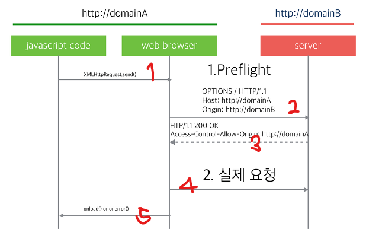

## 크로스도메인 & CORS

### 1. 크로스 도메인

-   #### 1-1 크로스 도메인

    -   서로 다른 도메인 간의 호출(Javascri로 접근하는 경우)을 말한다
    -   이경우 자바스크립트의 보안정책중 하나인 SOP에 걸려서 원하는 결과를 받을 수 없다.
    -   웹 브라우저 보안을 위해 프로토콜, 호스트, 포트가 동일한 서버로만 ajax 요청을 받을 수 있다.

-   #### 1-2 SOP (동일 출처 정책)

    -   Same-Orgin-Policy, 동일 출처 정책
    -   자바스크립트의 보안정책중 하나로 프로토콜, 호스트, 포트가 동일해야한다.
    -   Javascript는 같은 도메인 내에서만 작동하는 것을 원칙으로 한다.

    |  |
    | ------------------------- |

-   #### 1-3 크로스 도메인 회피

    -   **(방법1)** 외부 요청을 가능하게 해주는 플러그인 설치
        서버에서 받은 요청의 응답에 권한을 주는 특정 header만 추가하면 웹 브라우저가 요청이 가능한 사이트로 인식해서 요청이 가능해진다. 크롬의 경우 웹스토에서 요청을 가로채서 응담에 위 header를 추가해주는 플러그인이 있다. (웹 스토에서 cors검색)

    -   **(방법2)** JSONP방식으로 요청
        웹 브라우저에서 css나 js같은 리소스 파일들은 동일 출저 정책에 영향을 받지 않고 로딩이 가능하다. 이런 점을 이용하여 외부 서버에서 읽어온 js 파일을 json 파일로 바꿔주는 일종의 편법적인 방법이다. 단점은 리소스 파일을 GET 메서드로 읽어오기 때문에 GET 방식의 API만 요청이 가능하다.

    -   **(방법3)** CORS 작동 방식
        요청하려는 URL이 외부 도메인 일때 웹 브라우저는 preflight request(사전 요청)을 먼저 날린다.
        이러한 사전 요청을 통해 권한이 있는지 없는지 확인 가능하며 서버쪽에서 이러한 사전 요청이 올 때 도메인에 접근할 수 있는 권한을 헤더에 추가하여 다시 보낸다. 이 헤더를 통해 도메인이 다르지만 ajax 요청이 가능해진다.

-   #### 출처
    -   https://brunch.co.kr/@adrenalinee31/1
    -   https://velog.io/@yejinh/CORS-4tk536f0db

### 2. CORS

-   #### 정의
    -   Cross Origin Resource Sharing (교차 출처 자원 공유)
    -   웹 브라우저에서 외부 도메인 서버와 통신하기 위한 방식을 표준화한 스팩이다.
    -   서버와 클라이언트가 정해진 헤더를 통해 서로 요청이나 응답에 반응할 수 있는지 결정하는 방식이다.
-   #### 원리

    1. 요청하려는 url이 외부 도메인 일 때 웹 부라우저는 prefight request(사전요청)을 보냄
    2. 서버쪽에서 접근을 허용하는 헤더를 추가하여 보냄
    3. 실제요청
    4. 데이터를 받음

    |  |
    | ------------------------- |

-   #### 출처
    -   https://enterkey.tistory.com/409
